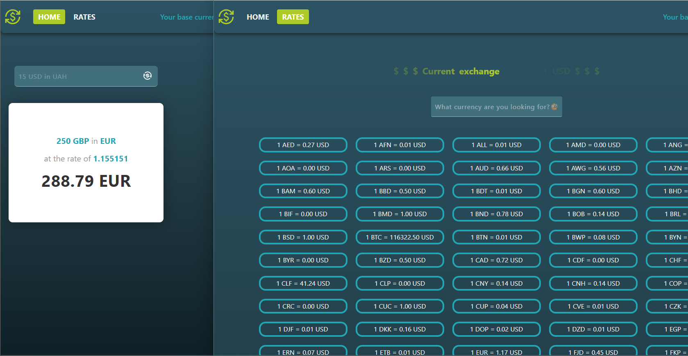

# 💱 Exchange Rate Management — Next.js App

### _A modern Next.js (App Router) application demonstrating API integration, currency conversion, server-side data fetching, and client-side caching with React Query._

---

### 🔗 **Live App**

https://exchange-rate-management.vercel.app/

---

## 📌 Overview

A production-style **Next.js App Router** project showcasing:

- server-side fetching for fast initial load
- client-side caching and background refetching via **TanStack Query**
- real-time currency conversion
- clean API integration with **Axios + TypeScript**
- separation of server & client components following Next.js best practices

This project highlights practical modern front-end engineering skills expected in commercial React/Next roles.

---

## 🖼️ Preview

---

## ✨ Key Features

- ⚡ **Next.js App Router architecture**
- 🧮 **Real-time currency conversion**
- 🌍 **Full list of supported exchange rates**
- 🔄 **React Query caching + stale-while-revalidate**
- 🟡 **Loading and error UI states**
- 📡 **Typed Axios API layer**
- 🧩 **Modular, maintainable folder structure**

---

## 🛠 Tech Stack

- **Next.js 15 (App Router)**
- **React 18**
- **TypeScript**
- **TanStack Query (React Query)**
- **Axios**
- **CSS Modules**
- **ESLint + Prettier**
- **Vercel Deployment**

---

🚀 Built to demonstrate real-world Next.js & API-driven application skills.

